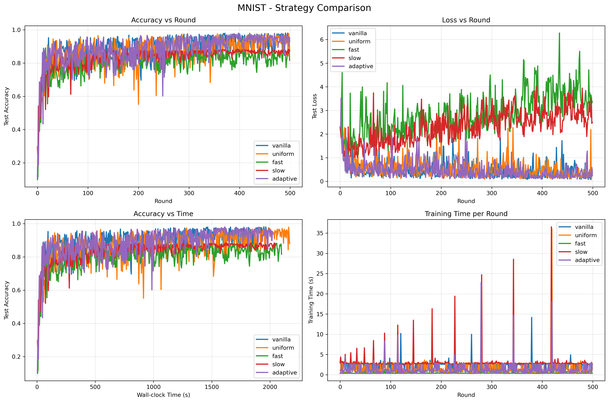

# TiFL 论文复现项目

## 项目概述

本项目是对论文《TiFL: A Tier-based Federated Learning System (arXiv:2001.09249)》的完整复现实现。

## 项目结构

```
tifl_project/
├── data/                    # 数据加载与Non-IID划分
│   └── loader.py           # 数据集加载和Non-IID划分
├── models/                 # 模型定义
│   └── networks.py         # CNN模型定义
├── core/                   # 核心组件
│   ├── client.py           # 客户端实现
│   ├── server.py           # 服务器端FedAvg聚合
│   └── tiering.py          # 分层系统和自适应调度器
├── strategies/             # 选择策略
│   └── selector.py         # 5种客户端选择策略
├── experiments/            # 实验执行
│   └── trainer.py          # 主训练流程
├── results/                # 结果存储
│   ├── metrics/           # 实验指标
│   ├── plots/             # 可视化图表
│   └── logs/              # 训练日志
├── config.yaml            # 实验配置
├── main.py                # 主执行脚本
├── visualize.py           # 结果可视化
├── run_all.sh             # 批量运行脚本
└── requirements.txt       # 依赖包
```

## 安装依赖

```bash
pip install -r requirements.txt
```

## 使用方法

### 1. 单个实验运行

```bash
# 运行 MNIST + vanilla 策略
python main.py --dataset mnist --strategy vanilla

# 运行 MNIST + TiFL 自适应策略
python main.py --dataset mnist --strategy adaptive

# 运行 CIFAR-10 + fast 策略
python main.py --dataset cifar10 --strategy fast
```

### 2. 批量运行所有实验

```bash
./run_all.sh
```

### 3. 可视化结果

```bash
# 生成 MNIST 的对比图
python visualize.py --dataset mnist

# 生成所有数据集的对比图
for dataset in mnist fashion_mnist cifar10; do
    python visualize.py --dataset $dataset
done
```

## 实验配置

实验参数在 `config.yaml` 中配置，包括：

- **数据集**: MNIST, Fashion-MNIST, CIFAR-10
- **策略**: vanilla, uniform, fast, slow, adaptive (TiFL)
- **客户端数量**: 50
- **训练轮数**: 500
- **每轮选择客户端数**: 5
- **层级数量**: 5

## 预期结果

根据论文，TiFL (adaptive) 策略应该在保持准确率的同时，训练时间比 vanilla 策略快 **3-5倍**。

## 主要特性

1. **完整复现**: 包含论文中的所有组件和策略
2. **Non-IID数据**: 符合联邦学习场景的数据分布
3. **分层系统**: 基于客户端延迟的5层分层
4. **自适应调度**: 基于Credits机制的智能客户端选择
5. **全面评估**: 准确率、损失、训练时间等多维度指标
6. **可视化**: 自动生成对比图表

## 验证标准

- MNIST vanilla: 500轮达到 ~95% 准确率
- TiFL 训练时间比 vanilla 快 3-5倍
- Fast 策略准确率略低 (~2-3%)
- Slow 策略时间最长但准确率最高

## 故障排查

如遇到内存不足问题，可在 main.py 开头添加：
```python
import tensorflow as tf
gpus = tf.config.list_physical_devices('GPU')
for gpu in gpus:
    tf.config.experimental.set_memory_growth(gpu, True)
```

如需加快测试速度，可修改 config.yaml 中的参数：
```yaml
common:
  num_clients: 25    # 从50减少到25
  num_rounds: 250    # 从500减少到250
```
--------------------------------------------------------------------------------

🔍 第 100 轮各策略对比
================================================================================
          策略        准确率        损失值         训练时间         累计时间
--------------------------------------------------------------------------------
     vanilla          0.8416       0.5184         2.56s            396.7s
     uniform          0.8324       0.6261         0.99s            451.0s
        fast          0.8106       2.1604         0.34s            403.7s
        slow          0.8287       1.5509         2.79s            408.6s
    adaptive          0.9544       0.1459         0.68s            391.0s


🔍 第 500 轮各策略对比
================================================================================
          策略        准确率        损失值         训练时间         累计时间
--------------------------------------------------------------------------------
     vanilla          0.9312       0.3797         2.72s           1977.9s
     uniform          0.8799       0.4818         1.38s           2167.5s
        fast          0.8167       3.3746         0.35s           2098.7s
        slow          0.8717       2.4945         2.65s           2046.9s
    adaptive          0.9509       0.2417         2.68s           2019.9s

结果展示：
